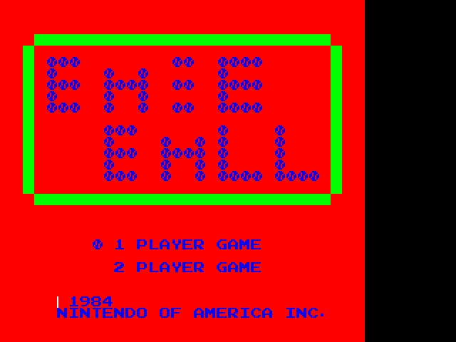
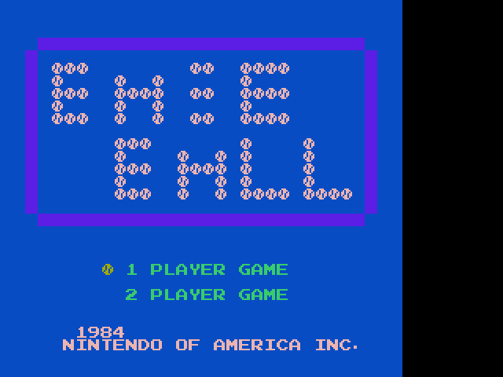
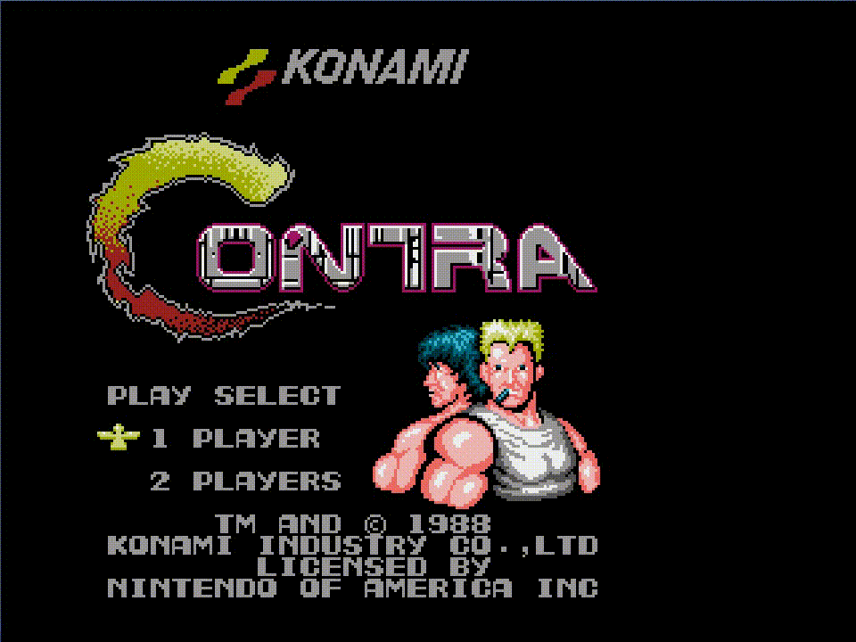
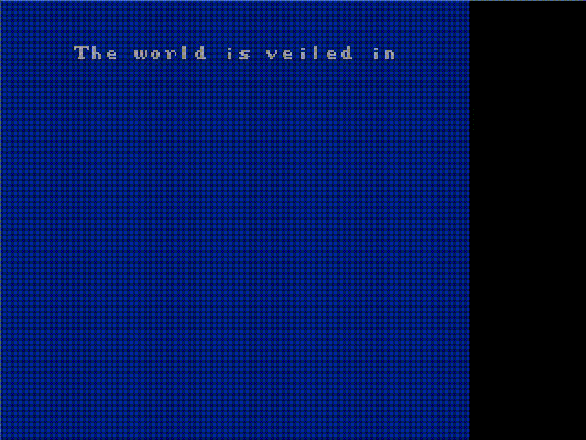
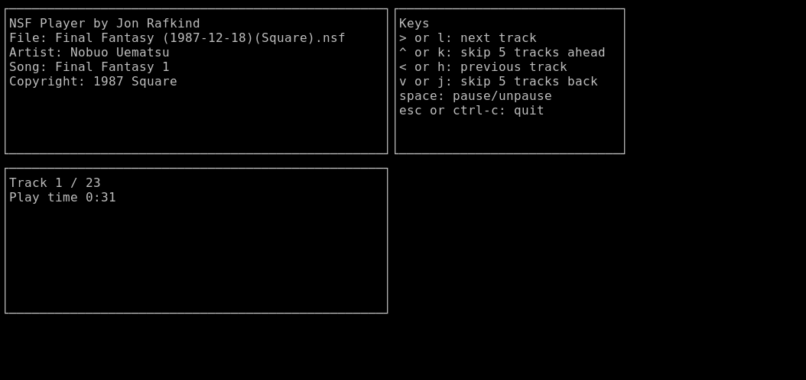

An NES emulator written in Go.

[](https://github.com/kazzmir/nes/actions/workflows/build-linux.yml)
[](https://github.com/kazzmir/nes/actions/workflows/build-macos-m1.yml)
[](https://github.com/kazzmir/nes/actions/workflows/build-windows.yml)

Play in a browser:

https://kazzmir.itch.io/nes

Resources:

* Nes Development Wiki http://wiki.nesdev.org/w/index.php/Nesdev_Wiki

* Another nes emulator in go https://github.com/fogleman/nes

Usage:

```
$ ./nes somerom.nes
```

Keys:
```
up arrow = up
down arrow = down
left arrow = left
right arrow = right
enter = start
Q = select
A = a
S = b
```

Other keys:
```
~ = speed up emulator by 3x
- = slow down emulator by 0.1
= = speed up emulator by 0.1
0 = set emulator speed back to normal (1)
space = pause/unpase emulator
R = restart emulator
P = enable ppu debugging
O = stop the emulator after each frame, press O repeatedly
```

Build instructions:

Needs go 1.18 or higher

Install libSDL2, libSDL2-ttf, and libSDL2-mixer
```
$ sudo apt install libsdl2-dev libsdl2-ttf-dev libsdl2-mixer-dev
```

Using make
```
$ make
```

Or pure go
```
$ go build ./cmd/nes
```

NSF player is an ncurses terminal based music player of nsf files.
```
$ make nsf
```
or
```
$ go build ./cmd/nsf
```

```
$ ./nsf somefile.nsf
```

Log:

6/20/2020: cpu is mostly complete



6/23/2020: The first time the emulator was able to render an image. This is from the Baseball game. It was very exciting to see an image show up, even if the colors are not exactly correct! Mostly the difficulty in getting to this point was understanding pattern tables and nametables.



6/24/2020: The same Baseball game but rendered with colors from a palette derived from the pattern attributes. I think the colors are still wrong here, as other rom's show a lot of dark blue as well, but its a step in the right direction.


6/28/2020: Contra is playable where sprites are kind of rendered, but the background doesn't scroll. This also demonstrates mapper 2, which contra uses.

6/29/2020: I was using SDL to call `SDL_DrawPoint` on a renderer for each pixel rendered by the PPU, but this ended up making frames take 10-20ms to render, which seems absurdly long for a modern machine (even with software rendering). The reason seems to be that each call to `SDL_DrawPoint` incurs a runtime.cgocall invocation, which has high overhead. The pprof cpu profile demonstrates this:

```
(pprof) top 10
Showing nodes accounting for 21830ms, 77.11% of 28310ms total
Dropped 124 nodes (cum <= 141.55ms)
Showing top 10 nodes out of 50
      flat  flat%   sum%        cum   cum%
   14320ms 50.58% 50.58%    19380ms 68.46%  runtime.cgocall
    1390ms  4.91% 55.49%     1670ms  5.90%  runtime.mapiternext
    1350ms  4.77% 60.26%     2310ms  8.16%  runtime.exitsyscallfast
    1210ms  4.27% 64.54%     1210ms  4.27%  runtime.casgstatus
     800ms  2.83% 67.36%     4320ms 15.26%  runtime.exitsyscall
     790ms  2.79% 70.15%      790ms  2.79%  runtime.wirep
     530ms  1.87% 72.02%     1990ms  7.03%  runtime.cgoCheckPointer
     520ms  1.84% 73.86%    23330ms 82.41%  github.com/kazzmir/nes/lib.(*PPUState).Render
     490ms  1.73% 75.59%     2350ms  8.30%  github.com/kazzmir/nes/lib.(*CPUState).LoadMemory
     430ms  1.52% 77.11%     1040ms  3.67%  runtime.cgoIsGoPointer
```



Colors have been fixed, and rendering uses an in-memory `[]uint32` array, which is uploaded to a texture and rendered to the window using hardware acceleration. 60fps is easily achievable, and at an uncapped NES CPU my machine can render about 250fps.



7/4/2020: Mapper 1 is implemented so final fantasy and legend of zelda are somewhat playable. Scrolling is still not implemented so a lot of the graphics in final fantasy show up incorrectly. Also none of my characters have a weapon.


7/5/2020: Scrolling mostly works. The gif here is smaller and shorter in time to keep the file size low. Both vertical and horizontal scrolling work, as tested with the purely vertical scrolling game ice climbers. There are some remaining glitches with scrolling as walking around the map in final fantasy renders the wrong tiles a lot of the time.

8/18/2020: Audio, scrolling, and tons of other stuff is working much better. I added the ability to directly record a video from the emulator using ffmpeg. Here is a video showing off a few games that work well.

[](https://youtube.com/watch?v=X8OQhbjnr9o)

8/23/2020: Added an nsf player. The format is not 100% supported yet as it does not support bank switching or PAL speeds, but most nsf files I can find seem to play properly.



12/18/2024: Added support for [VRC6](https://www.nesdev.org/wiki/VRC6_audio) and bank switching in NSF files. Also the code can now be built for the windows platform.

1/31/2026: Migrated the project from SDL to [ebiten](https://ebitengine.org).
